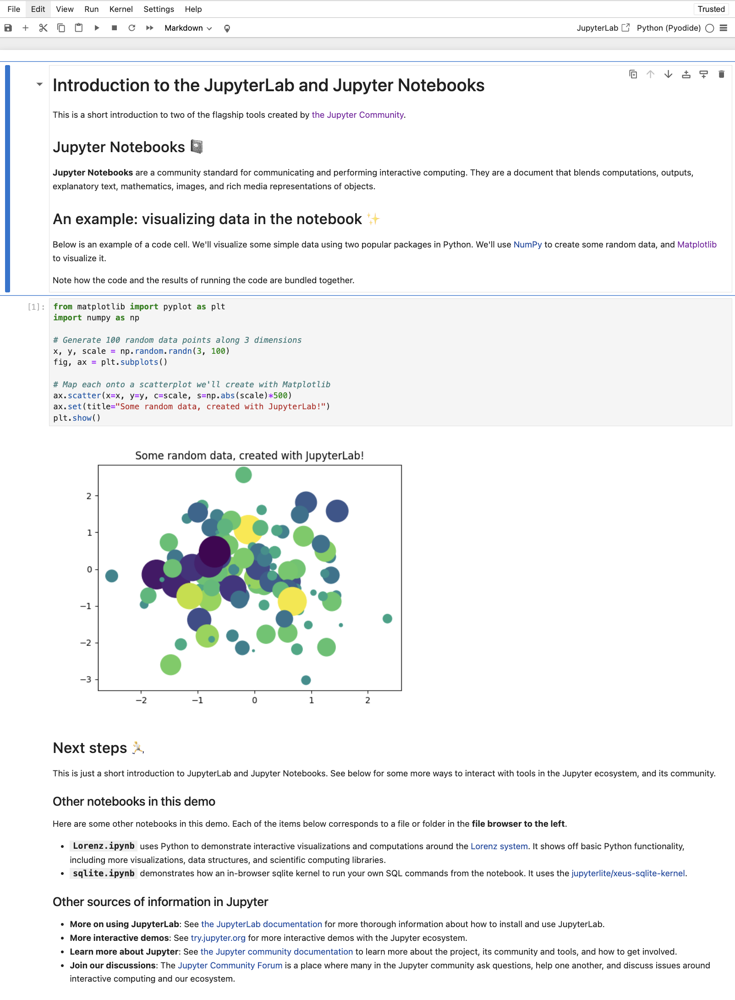
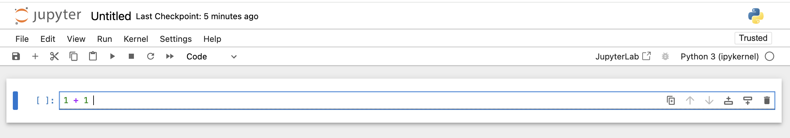
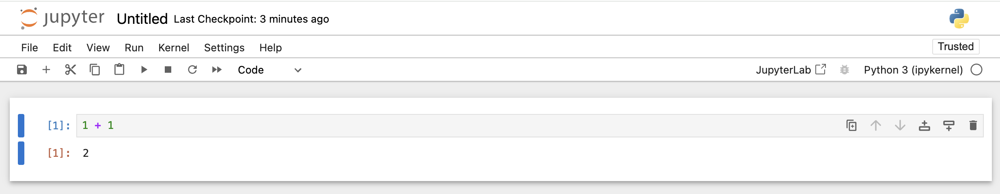
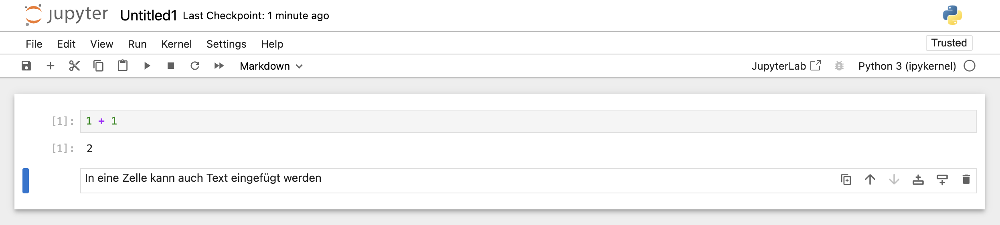
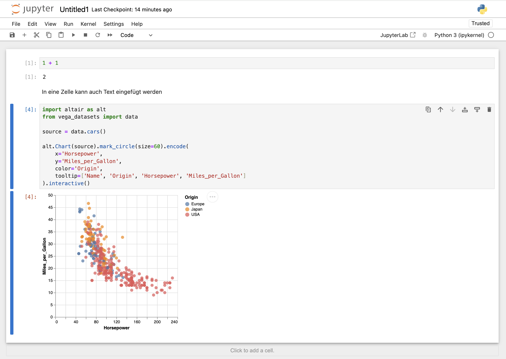
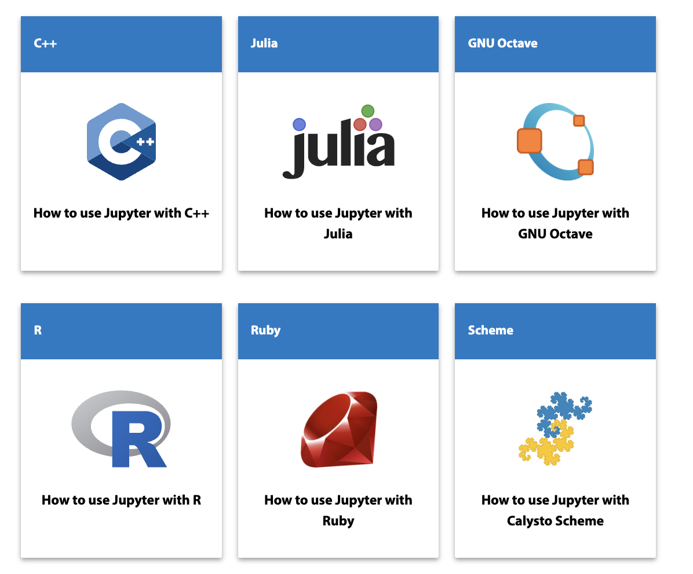

# Jupyter Notebook

In der Welt der Data Science und künstlichen Intelligenz ist Jupyter Notebook ein wichtiges Werkzeug. Es ist in der Anaconda-Distribution enthalten und bietet eine leistungsstarke Umgebung für interaktive Code-Entwicklung und Datenanalyse.

:::{.callout-note}
Jupyter Notebook ist mehr als nur ein einfacher Code-Editor. Es ist eine webbasierte, interaktive Umgebung, die es uns ermöglicht, Python-Code zu schreiben und auszuführen, erklärende Texte zu integrieren und die Ergebnisse unserer Analysen direkt in der Web-Oberfläche zu visualisieren.
:::


{#fig-jupyter-notebook width="50%" }

Im Vergleich zum eher einfachen Python IDLE bietet Jupyter Notebook eine Reihe von Vorteilen, die unsere Arbeit erheblich erleichtern:

1. **Interaktive Code-Ausführung:** In Jupyter Notebook arbeiten wir mit sogenannten "Zellen". Jede Zelle kann Python-Code enthalten, den wir unabhängig voneinander ausführen können. Dies ermöglicht uns, unseren Code schrittweise zu entwickeln und zu testen, was besonders bei komplexen Datenanalysen von Vorteil ist. 

   {#fig-jupyter-notebook-mathe-1 width="100%" }


2. **Reproduzierbarkeit:** Jupyter Notebooks speichern nicht nur unseren Code, sondern auch die Ausgaben. Dies bedeutet, dass wir unsere gesamte Analyse, einschließlich der Ergebnisse, in einer einzigen Datei speichern und mit anderen teilen können. Dies fördert die Reproduzierbarkeit unserer Arbeit und erleichtert die Zusammenarbeit im Team.

   {#fig-jupyter-notebook-mathe width="100%" }


3. **Nahtlose Integration von Code und Dokumentation:** Mit Jupyter Notebook können wir durch die Umstellung einer Zelle in den "Markdown"-Modus (mehr dazu in dem Kapitel über [Markdown](/markdown.qmd))  problemlos zwischen Code und Erklärungen wechseln. Dies hilft uns, unsere Gedankengänge und Analyseansätze klar zu dokumentieren.

   {#fig-jupyter-notebook-text width="100%" }

4. **Sofortige Visualisierung von Ergebnissen:** Eines der besonderen Merkmale von Jupyter Notebook ist die Möglichkeit, Diagramme, Grafiken und andere Visualisierungen direkt im Notebook anzuzeigen. Dies gibt uns unmittelbares visuelles Feedback zu unseren Analysen und ist besonders wertvoll für explorative Datenanalysen.

   {#fig-jupyter-notebook-altair width="100%" }


5. **Flexibilität:** Neben Python unterstützt Jupyter Notebook auch viele andere Programmiersprachen. Dies gibt uns die Flexibilität, bei Bedarf zwischen verschiedenen Sprachen zu wechseln.

   {#fig-jupyter-notebook-mathe width="100%" }


Im nächsten Abschnitt erstellen wir einen Jupyter Notebook.

## Jupyter Notebook erstellen

Hier der Prozess zur Erstellung eines Jupyter Notebooks:

1. **Starten des Anaconda Navigators:**
   - Für Windows-Nutzer: Startmenü öffnen und nach "Anaconda Navigator" suchen. Ein Klick darauf startet die Anwendung.
   - Für macOS/Linux-Nutzer: Wir können entweder in unseren Anwendungen nach "Anaconda Navigator" suchen oder ein Terminal öffnen und folgenden Befehl eingeben:
     ```bash
     anaconda-navigator
     ```

2. **Jupyter Notebook starten:**
   Im Anaconda Navigator finden wir die Kachel für Jupyter Notebook. Ein Klick auf "Launch" öffnet Jupyter Notebook in unserem Standard-Webbrowser.

   {#fig-anaconda-navigator-jupyter width="100%" }


3. **Navigation zum richtigen Verzeichnis:**
   In der Web-Oberfläche von Jupyter navigieren wir zum `code`-Verzeichnis. Dieses Verzeichnis ist Teil unserer [eingerichteten Ordnerstruktur](projektumgebung.qmd), die uns hilft, unsere Projekte übersichtlich zu organisieren. Zunächst den Ordner "toolkit-lab" öffnen und dann den Unterornder "code".


   {#fig-jupyter-toolkit-lab-code width="100%" }


4. **Erstellung eines neuen Notebooks:**
   Oben rechts klicken wir auf "New" und wählen "Notebook" aus der Drop-down-Liste. Dies erstellt ein neues, leeres Notebook.


   {#fig-jupyter-notebook-new-notebook width="100%" }

5. **Auswahl des Kernels:**
   Nun öffnet sich ein Fenster, in dem wir den Kernel (eine Python-Instanz) auswählen können. Für den Anfang wählen wir die von Anaconda installierte `base`-Umgebung aus. Alternativ dazu kann auch Python 3 (ipykernel) ausgewählt werden.

6. **Unser erstes Notebook ist bereit:**
   Eine neue Notebook-Seite öffnet sich mit einer leeren Code-Zelle, bereit für unseren ersten Python-Code.


Jetzt, wo unser Notebook geöffnet ist, können wir mit dem Schreiben von Code beginnen:

1. In die erste Zelle geben wir einen einfachen Python-Code ein, zum Beispiel:
   ```python
   print("Hello, Jupyter!")
   ```

2. Um diesen Code auszuführen, drücken wir `Shift+Enter` oder klicken auf den "Run"-Button in der Toolbar. Die Ausgabe erscheint direkt unter der Zelle.

3. Jupyter Notebook erstellt automatisch eine neue Zelle unter der ausgeführten Zelle. Hier können wir weiteren Code eingeben oder die Zelle in eine Markdown-Zelle umwandeln, um erklärenden Text hinzuzufügen.


Es ist wichtig, unsere Arbeit regelmäßig zu speichern:

1. Im "File"-Menü wählen wir "Save" aus, oder wir nutzen das Disketten-Symbol in der Toolbar.

2. Beim ersten Speichern werden wir nach einem Namen für unser Notebook gefragt. Wir nennen es `hello-jupyter.ipynb` und speichern es im `code`-Verzeichnis.

:::{.callout-note}
Die Dateierweiterung `.ipynb` steht für "IPython Notebook". Diese Dateien enthalten nicht nur unseren Code, sondern auch alle Ausgaben, Markdown-Texte und sogar eingebettete Visualisierungen. 
:::

Jede `.ipynb`-Datei ist im [JSON-Format](../daten/json.qmd) strukturiert und enthält eine geordnete Liste von "Zellen". Diese Struktur bietet uns mehrere Vorteile:

1. **Selektive Ausführung:** Wir können einzelne Codeabschnitte ausführen, ohne das gesamte Skript neu starten zu müssen. Dies ist besonders nützlich bei zeitaufwändigen Berechnungen oder beim Testen verschiedener Ansätze.

2. **Nicht-lineare Arbeitsweise:** Im Gegensatz zu traditionellen Python `.py`-Skripten, die von Anfang bis Ende ausgeführt werden, können wir in einem Jupyter Notebook Zellen in beliebiger Reihenfolge ausführen. Dies unterstützt einen explorativen Ansatz in der Datenanalyse.

3. **Einfache Überarbeitung:** Wir können jederzeit zu früheren Zellen zurückkehren, den Code ändern und neu ausführen, ohne den gesamten Arbeitsablauf zu stören.

4. **Integrierte Dokumentation:** Durch die Kombination von Code- und Markdown-Zellen können wir unsere Analysen direkt im Notebook ausführlich dokumentieren. Dies fördert die Reproduzierbarkeit und macht es einfacher, unsere Arbeit mit anderen zu teilen oder zu einem späteren Zeitpunkt nachzuvollziehen.

