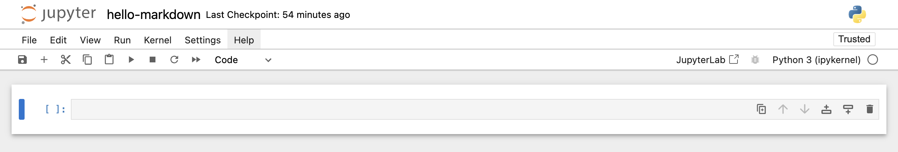
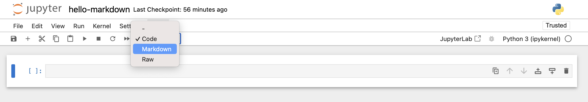
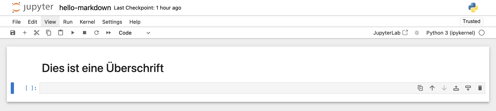

# Markdown 

Markdown ist eine einfache Auszeichnungssprache (d.h. ein System zur Formatierung von Text), die entwickelt wurde, um leicht in HTML umgewandelt zu werden. Aufgrund ihrer Einfachheit und Vielseitigkeit wird sie häufig verwendet und eignet sich sehr gut für Dokumentationen, Berichte und die Aufzeichnung von Forschungsergebnissen.

In der Datenwissenschaft findet Markdown breite Anwendung. Wir nutzen es nicht nur zur Dokumentation von Projekten, sondern auch zur Erstellung dynamischer Berichte. Diese Berichte verbinden nahtlos erklärenden Text mit den Ergebnissen von Datenanalysen, oft mithilfe von Werkzeugen wie Jupyter Notebooks.

## Markdown in Jupyter Notebook 

Um mit Markdown in Jupyter Notebook zu beginnen, folgen wir diesen Schritten:

1. Wir erstellen ein neues Jupyter-Notebook, wie zuvor in diesem Leitfaden zu [Jupyter Notebook starten](jupyter-notebook#jupyter-notebook-erstellen.qmd).
2. Wir benennen unser Notebook `hello-markdown.ipynb` und speichern es im Ordner `code`:
   - Dazu navigieren wir zu "File > Save As..." und geben den Namen `hello-markdown` ein.
3. Auf die erste Zelle klicken, so dass diese am linken Rand blau markiert erscheint.

   {#fig-jupyter-notebook-markiert width="100%" }

3. Wir ändern den Zelltyp der ersten Zelle mithilfe des Dropdown-Menüs in der Symbolleiste auf "Markdown".


   {#fig-jupyter-notebook-markiert-markdown width="100%" }


4. Nun kann Text in diese Zelle eingegeben werden. In diesem Beispiel fügen wir eine Überschrift in die Zelle ein. Dies wird in Markdown mit der Auszeichnung `#` erzielt.

   ```markdown
   # Dies ist eine Überschrift
   ```

   {#fig-jupyter-notebook-h1 width="100%" }


5. Um den Markdown-Text zu rendern (d.h. in HTML umzuwandeln), führen wir die markierte Zelle mit `Shift+Eingabetaste` aus oder nutzen den Run-Button (die Zelle muss dafür blau markiert sein). Dies überführt den "rohen" Markdown-Text in eine HTML-Ausgabe:

   {#fig-jupyter-notebook-h1-rendered width="100%" }

In dem folgenden Abschnitt behandelen wir einige nützliche Markdown-Formatierungsoptionen. 


## Markdown-Basics

### Überschriften

Mit Überschriften strukturieren wir unser Dokument und schaffen eine Hierarchie der Abschnitte.

```markdown
# Hauptüberschrift (H1)
## Unterüberschrift (H2)
### Kleinere Unterüberschrift (H3)
```

### Listen

Listen helfen uns, Informationen klar und prägnant zu organisieren.

Geordnete Listen:

```markdown
1. Erster Punkt
2. Zweiter Punkt
```

1. Erster Punkt
2. Zweiter Punkt

Ungeordnete Listen:

```markdown
- Aufzählungspunkt A
- Aufzählungspunkt B
```

- Aufzählungspunkt A
- Aufzählungspunkt B

### Hervorhebungen

Durch Hervorhebungen können wir wichtige Punkte betonen. Dafür können wir die Auszeichnung mit dem Symbol `*` oder alternativ mit `_` vornehmen.

```markdown
*Kursiv*  
**Fett**  

_Kursiv mit Unterstrichen_  
__Fett mit Unterstrichen__
```

*Kursiv*  
**Fett**  

_Kursiv mit Unterstrichen_  
__Fett mit Unterstrichen__

### Blockzitate

Blockzitate verwenden wir, um Quellen oder wichtige Informationen zu zitieren.

```markdown
> "Dies ist ein Blockzitat."
```

> "Dies ist ein Blockzitat."

### Tabellen

Tabellen sind entscheidend für die effiziente Organisation von Daten.

```markdown
| Spalte 1 | Spalte 2 |
|----------|----------|
| Zeile 1  | Wert 1   |
```

| Spalte 1 | Spalte 2 |
|----------|----------|
| Zeile 1  | Wert 1   |


Im Internet finden sich zahlreiche Tools, um einfach Markdown-Tabellen erstellen zu können (bspw. [Table to Markdown](https://tabletomarkdown.com/generate-markdown-table/))


### Links und Bilder

Mit Links und Bildern bereichern wir unser Dokument und bieten zusätzlichen Kontext.

Links:

```markdown
[Python-Dokumentation](https://docs.python.org/)
```

[Python-Dokumentation](https://docs.python.org/)

Bilder:

```markdown

```

### Mathematische Ausdrücke

Durch die Integration von LaTeX können wir komplexe mathematische Formeln darstellen.

Inline-Gleichung:

```markdown
$E = mc^2$
```

$E = mc^2$

Block-Gleichung:

```markdown
$$
\frac{a}{b} + \sqrt{x}
$$
```

$$
\frac{a}{b} + \sqrt{x}
$$

### Horizontale Linien

Horizontale Linien helfen uns, Abschnitte visuell zu trennen.

```markdown
---
```

---

### Code-Blöcke

Mit Code-Blöcken präsentieren wir Code-Snippets und nutzen dabei Syntax-Hervorhebung.

````markdown
```python
print("Hallo, Python!")
```
````

```python
print("Hallo, Python!")
```

### Weiterführendes Lernen

Um das Verständnis von Markdown weiter zu vertiefen, können diese Ressourcen genutzt werden:

- [Interaktives 10-minütiges Markdown-Tutorial](https://commonmark.org/help/)  

- [Markdown meistern](https://guides.github.com/features/mastering-markdown/)


## Praktische Übung

Als nächstes werden wir das Gelernte in einer kleinen Übung anwenden:

1. Neues Jupyter Notebook öffnen.
2. Markdown-Zelle erstellen folgenden Text einfügen:

   ````markdown
   # Markdown-Dokument
   
   Hier ist eine Liste meiner Datenwissenschafts-Tools:
   
   1. Python
   2. Jupyter Notebooks
   3. Pandas
   
   Hier ist ein **wichtiger** Punkt zu beachten:
   
   > Üben ist der Schlüssel zum Erfolg!
   
   Dies ist als Python-Code formatierter Text innerhalb einer Markdown-Zelle (und kann deswegen nicht ausgeführt werden):

   ```python
   print("Hallo, Python!")
   ```
   ````

3. Zelle ausführen.


