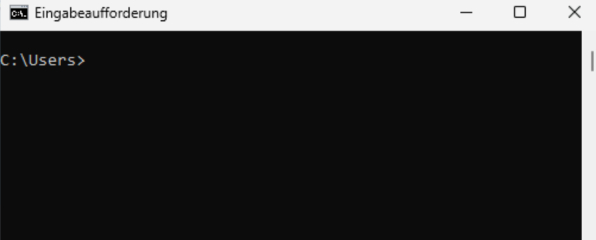
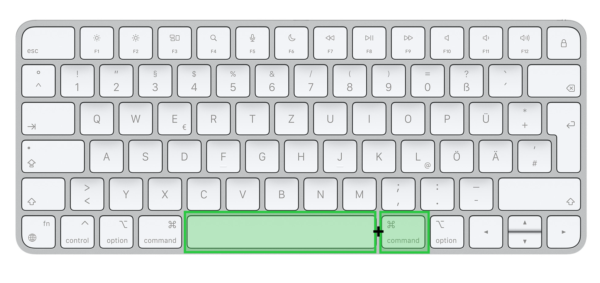

# Projektumgebung einrichten

Das Organisieren Ihrer Dateien ist entscheidend für die Effizienz und Zugänglichkeit Ihrer Projekte. Zunächst erstellen wir daher einen Ordner namens `toolkit-lab` auf Ihrem Rechner und legen die Unterverzeichnisse `code` und `data` an, um Ihr Projekt strukturiert zu halten.

Diese Ordnerstruktur kann wie folgt dargestellt werden:

::: {#fig-ordnerstruktur layout-ncol=2 layout-valign="bottom"}

{#fig-ordner width=35%}

{#fig-ordner2 width=45%}

Darstellung der Ordnerstruktur

:::

Für die Darstellung der Ordnerstruktur verwenden wir typischerweise eine Baumstruktur, wie in @fig-ordner2 dargestellt. Diese kann beispielsweise nach diesem Schema erzeugt werden:


```plaintext
toolkit-lab/
├── code/
└── data/
```

Anstatt eine grafische Benutzeroberfläche wie den Windows-Explorer oder den macOS Finder zu verwenden, werden wir die *Befehlszeile* verwenden, um die Ordner einzurichten. Die Befehlszeile ist ein leistungsstarkes Werkzeug zum Einrichten Ihrer Arbeitsumgebung. Sie ermöglicht eine  Kommunikation mit dem Betriebssystem über textbasierte Eingaben.

:::{.callout-note appearance="minimal"}
Die Befehlszeile eröffnet eine neue Ebene der Interaktion mit Ihrem Computer. Wenn Sie sich daran gewöhnt haben, werden Sie feststellen, dass viele Aufgaben effizienter erledigt werden können als mit einer grafischen Benutzeroberfläche.
:::


Weitere gängige Bezeichnung für die Befehlszeile sind Kommandozeile, Befehlszeilenschnittstelle, oder der englische Begriff "Command Line Interface", oft abgekürzt mit "CLI". In Windows ist die Bezeichnung für das entsprechende Programm *Eingabeaufforderung* (siehe @fig-eingabe), auf dem Mac heißt es *Terminal* (siehe @fig-terminal).

::: {#fig-cli layout-ncol=2 layout-valign="bottom"}

{#fig-eingabe }

{#fig-terminal}

Kommandozeilen 

:::

In den nächsten Abschnitten wird erklärt, wie die Ordner mit Hilfe der Befehlszeile eingerichtet werden können. 


## Projektumgebung in Windows

Folgen Sie diesen Schritten, um das Hauptverzeichnis und die Unterverzeichnisse mit der Windows-Eingabeaufforderung ("Command Prompt" bzw. "cmd") zu erstellen:

1. Geben Sie in dem Windows-Suchfenster `Eingabeaufforderung` oder `cmd` ein und drücken Sie `Enter`, um die Eingabeaufforderung zu öffnen.
3. Erstellen Sie einen neuen Ordner namens `toolkit-lab` (kopieren Sie diesen Code und geben Sie ihn in Ihre Eingabeaufforderung ein):

    ```bash
    mkdir toolkit-lab
    ```

4. Verwenden Sie `cd` (change directory), um in das Verzeichnis `toolkit-lab` zu wechseln:

    ```bash
    cd toolkit-lab
    ```

5. Verwenden Sie `mkdir` (make directory), um die Unterverzeichnisse `code` und `data` zu erstellen:

    ```bash
    mkdir code data
    ```

Wir haben damit ein Hauptverzeichnis `toolkit-lab` mit zwei Unterverzeichnissen eingerichtet: `code` für Ihre Skripte und `data` zum Speichern von Datensätzen.

## Projektumgebung auf Mac

Folgen Sie diesen Schritten, um das Hauptverzeichnis und die Unterverzeichnisse mit dem Terminal (dies ist die Bezeichnung der Befehlszeile in macOS und Linux) in macOS zu erstellen:


1. Um das Terminal in macOS zu öffnen, können Sie die Spotlight-Suche verwenden. Öffnen Sie diese mit der Tastenkombination `Cmd + Leertaste`.  

    {#fig-keyboard width="60%" .lightbox}


2. Geben Sie in der Spotlight-Suche "Terminal" ein und wählen Sie das Programm aus. Sie sollten nun das Terminal sehen können. 

    {#fig-terminal2 width="60%"}


   :::{.callout-note title="Erklärung der Terminal-Inhalte"}

   - *Benutzername*: In diesem Fall `jankirenz`. Es zeigt an, welcher Benutzer aktuell am System angemeldet ist.
   - *Hostname*: Hier `kirenziMac`. Dies ist der Name des Computers, auf dem das Terminal läuft.
   - *Aktuelles Verzeichnis (Pfad)*: Das `~` (Tilde) Symbol steht für das Home-Verzeichnis des aktuellen Benutzers. Der vollständige Pfad wäre also /Users/jankirenz. Es zeigt an, in welchem Verzeichnis Sie sich gerade befinden.
   - *Prompt*: Das `%` Symbol am Ende der Zeile ist der sogenannte Prompt. Er signalisiert, dass das Terminal bereit ist, einen neuen Befehl entgegenzunehmen.
   :::

2. Zuerst verwenden wir den Befehl pwd ("print working directory") und drücken die Eingabetaste, um den vollständigen Pfad des aktuellen Verzeichnisses anzuzeigen. Wenn Sie das Terminal gerade geöffnet haben, sollte das aktuelle Verzeichnis Ihr Home-Verzeichnis sein (in meinem Fall `/Users/jankirenz`, da mein Benutzerkonto jankirenz heißt):
    
    ```bash
    pwd
    ```

2. Erstellen Sie nun einen neuen Ordner namens `toolkit-lab` in dem Home-Verzeichnis (kopieren Sie diesen Code und geben Sie ihn in Ihr Terminal ein):

    ```bash
    mkdir toolkit-lab
    ```

3. Verwenden Sie `cd` (change directory), um in das Verzeichnis `toolkit-lab` zu wechseln:

    ```bash
    cd toolkit-lab
    ```

4. Verwenden Sie `mkdir` (make directory), um die Unterverzeichnisse `code` und `data` zu erstellen:

    ```bash
    mkdir code data
    ```

Wir haben damit ein Hauptverzeichnis `toolkit-lab` mit zwei Unterverzeichnissen eingerichtet: `code` für Ihre Skripte und `data` zum Speichern von Datensätzen.
