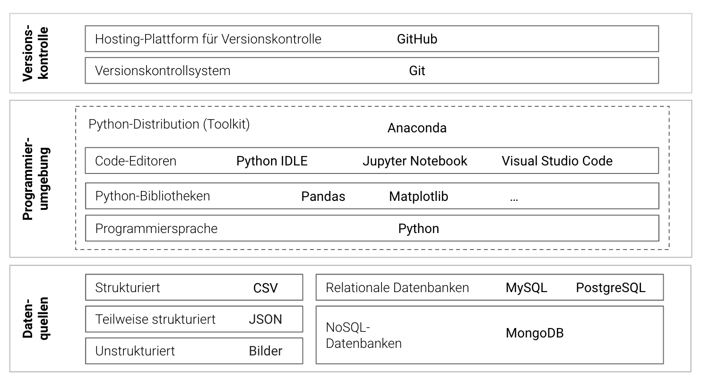

# Willkommen {.unnumbered}

Willkommen zum Einstieg in die faszinierende Welt der Data Science, Künstlichen Intelligenz (KI) und Analytik! Dieses Buch ist speziell für Einsteiger/innen konzipiert und bietet eine schrittweise Einführung in die grundlegenden Werkzeuge, die für den Erfolg in diesen Bereichen notwendig sind (siehe @fig-themen).

{#fig-themen}

Data Science, KI und Analytik spielen heute eine zentrale Rolle in vielen Branchen. Sie unterstützen Unternehmen dabei, fundierte Entscheidungen zu treffen, indem sie Daten analysieren und interpretieren sowie Arbeitsprozesse automatisieren. Beispielsweise kann in der Produktion mithilfe von Datenanalysen die Effizienz von Fertigungsprozessen verbessert werden, während im Controlling durch präzise Analysen bessere Finanzentscheidungen getroffen werden können. Generative AI ermöglicht es, kreative Lösungen zu entwickeln, wie z.B. das Erstellen von Marketinginhalten oder das Designen von Produkten.

Dieses Buch soll Ihnen den Einstieg in die Welt der Programmierung erleichtern und Ihnen helfen, die notwendigen Fähigkeiten im Umgang mit zentralen Tools zu entwickeln, um in der Data Science, Künstlichen Intelligenz und Analytik erfolgreich zu sein. Jeder Abschnitt enthält ausführliche Installationsanleitungen und erste Anwendungsbeispiele, um den Einstieg zu erleichtern und häufige Stolpersteine zu vermeiden. Egal, ob Sie in betriebswirtschaftlichen Bereichen, der IT, der Produktion oder anderen Abteilungen tätig sind, die hier erlernten Fähigkeiten werden Ihnen hilfreiche Werkzeuge an die Hand geben, um Ihre beruflichen Ziele zu erreichen.