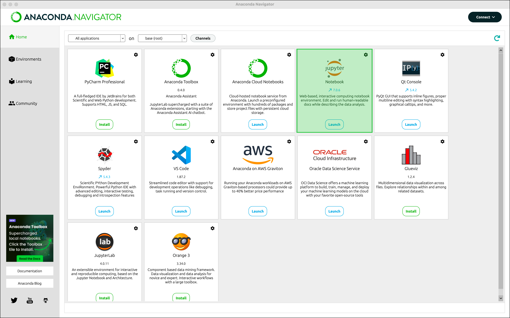
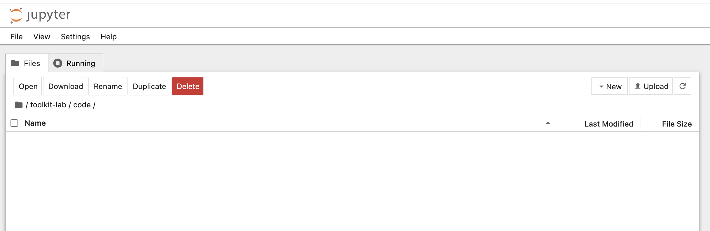
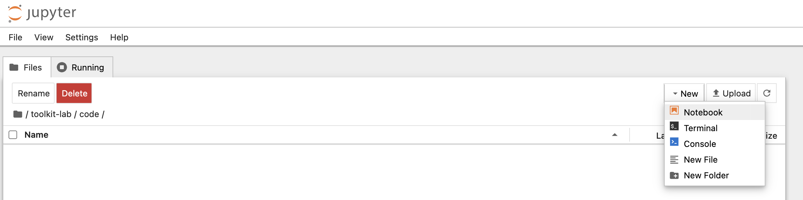

# Arbeitsbereich 

Bevor wir mit dem Programmieren in Python beginnen, stellen wir sicher, dass wir einen ordnungsgemäß konfigurierten Arbeitsbereich haben:


1. Anaconda Navigator starten:
   - Anaconda Navigator aus dem Anwendungsordner auf macOS oder dem Startmenü auf Windows öfnnen.

   {#fig-anaconda-navigator-2 width="100%"}


2. Jupyter Notebook öffnen:
   - Im Anaconda Navigator bei Jupyter Notebook auf 'Launch' klicken, um die Anwendung im Webbrowser zu öffnen.

   {#fig-anaconda-navigator-jupyter-2 width="100%"}


3. In der Web-Oberfläche von Jupyter zum *code*-Verzeichnis (siehe die Erklärung zur [Ordnerstruktur](../erste-schritte/projektumgebung.qmd)) navigieren.

   {#fig-jupyter-toolkit-lab-code-2 width="100%" }


4. Oben rechts auf "New" klicken und "Notebook" auswählen, um ein neues Notebook zu erstellen.

   {#fig-jupyter-notebook-new-notebook-2 width="100%" }

5. Nun öffnet sich ein Fenster in welchem wir den Kernel (eine Python-Instanz) auswählen können. Wir wählen die eben installierte `basics`-Umgebung aus (siehe [diese Anleitung](python-arbeitsbereich.qmd)).

6. In dem Notebook eine neue Markdown-Zelle erstellen, um dem Notebook einen Titel zu geben (z.B. Python basics):

   ```markdown
   # Python basics
   ```

7. Notebook speichern:
   - Notebook im `code` Ordner mit einem aussagekräftigen Namen (z.B. *python-basics.ipynb*) speichern.
