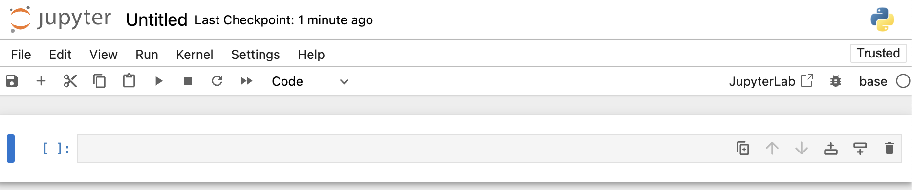

## Inhalte des Tutorials

:::: {.features}

::: {.feature .fragment .fade-in}
:::{.feature-header}
Was ist Jupyter Notebook? 
:::
Einführung und Vorteile
:::

::: {.feature .fragment .fade-up}
:::{.feature-header}
Erstellung eines Notebooks 
:::
Schritt-für-Schritt-Anleitung
:::

::: {.feature .fragment .fade-up}
:::{.feature-header}
Arbeiten mit Notebooks 
:::
Code, Markdown und mehr
:::

::::

## Was ist Jupyter Notebook? 

- Webbasierte, interaktive Entwicklungsumgebung
- Ermöglicht Kombination von Code, Text und Visualisierungen

. . .

{width="30%" fig-align="center"}


## Code-Ausführung in Zellen

{width="30%" fig-align="center"}


## Vorteile

- Nahtlose Integration von Code und Dokumentation
- Selektive Ausführung von Code
- Sofortige Visualisierung von Ergebnissen


{width="30%" fig-align="center"}


- Unterstützt mehrere Programmiersprachen
- In Anaconda-Distribution enthalten


## Erstellung eines Jupyter Notebooks

1. Anaconda Navigator starten
2. Jupyter Notebook launchen
3. Zum `code`-Verzeichnis navigieren
4. Neues Notebook erstellen
5. Kernel auswählen (z.B. `base`)

::: {.fragment .fade-in}
{width="50%" fig-align="center"}
:::

## Demo Erstellung Jupyter Notebook


## Arbeiten mit Notebooks

- Code in Zellen eingeben und ausführen
- Markdown für Dokumentation nutzen
- Visualisierungen direkt im Notebook anzeigen
- Regelmäßiges Speichern nicht vergessen!


## Beispiel: Erste Schritte

. . .

```python
print("Hello, Jupyter!")
```

- Ausführen mit `Shift+Enter` oder den "Run"-Button

## Struktur von Jupyter Notebooks

- Dateiendung: `.ipynb`
- JSON-Format
- Enthält geordnete Liste von "Zellen"
- Speichert Code, Ausgaben, Markdown und Visualisierungen


## Zusammenfassung

:::: {.features}

::: {.feature .fragment .fade-in}
:::{.feature-header}
Jupyter Notebook 
:::
Leistungsstarke, interaktive Entwicklungsumgebung
:::

::: {.feature .fragment .fade-up}
:::{.feature-header}
Funktionen 
:::
Code-Ausführung  
Dokumentation  
Visualisierung in einem Tool  
:::

::: {.feature .fragment .fade-up}
:::{.feature-header}
Vorteile 
:::
Flexibilität  
Reproduzierbarkeit   
verbesserte Zusammenarbeit  
:::

::::


