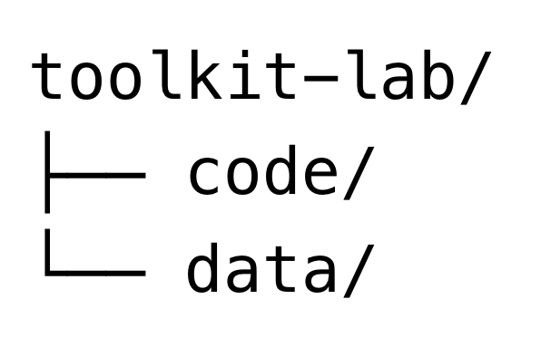
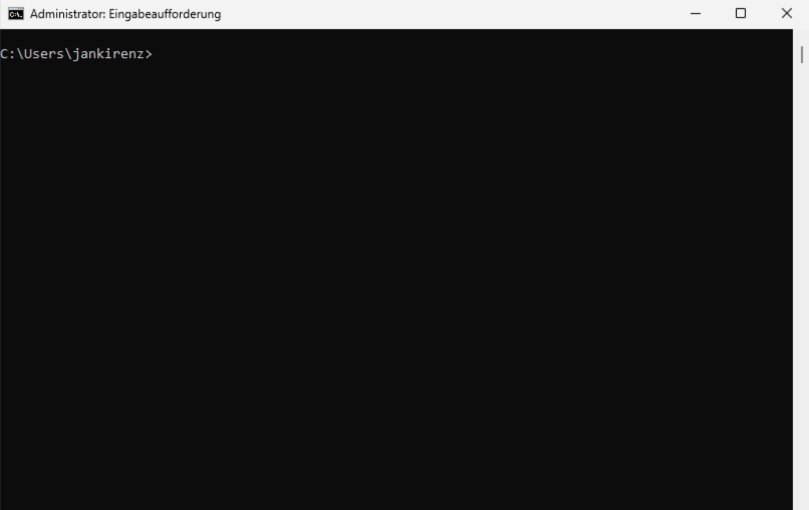

## Inhalte des Tutorials

:::: {.features}

::: {.feature .fragment .fade-in}
:::{.feature-header}
Projektstruktur
:::
Ordnerstruktur anlegen
:::

::: {.feature .fragment .fade-up}
:::{.feature-header}
Befehlszeile
:::
Grundlagen verstehen
:::

::: {.feature .fragment .fade-up}
:::{.feature-header}
Betriebssysteme
:::
Windows vs. macOS
:::

::::

## Projektstruktur

::: {layout-ncol=2 layout-valign="bottom"}

{width=45% fig-align="left"}

{width=55% fig-align="left"}

:::

# GUI vs Befehlszeile  

## Überblick

- **GUI**: Grafische Benutzeroberfläche (z.B. Windows Explorer, macOS Finder)

- **Befehlszeile**: Textbasierte Interaktion mit dem Betriebssystem

. . .

::: {.callout-tip appearance="simple"}
Befehlszeile: effizientere Aufgabenausführung als eine GUI.
:::

## Bezeichnungen der Befehlszeile

- Kommandozeile
- Befehlszeilenschnittstelle
- Command Line Interface (CLI)

. . .

::: {.callout-tip appearance="simple"}

- Windows: Eingabeaufforderung und PowerShell
- macOS: Terminal oder [iTerm2](https://iterm2.com/)

:::

## Bedeutung der Befehlszeile

- Wichtige Fähigkeit in Datenanalyse und Softwareentwicklung
- Ermöglicht präzise Kontrolle über das System
- Nützlich für Automatisierungen

## Windows Eingabeaufforderung

 

{width=100% fig-align="left"}

## MacOS Terminal

 

{width=100% fig-align="left"}

# Shells {.custom-gradient}

## Shell-Konzept

- Shell: Vermittler zwischen Benutzer und Betriebssystem
- Interpretiert Eingaben und übersetzt sie in Systemanweisungen

. . .

::: {.callout-tip appearance="simple"}
- Befehlszeile = "Blatt Papier" für Anweisungen
- Shell = "Übersetzer" der Anweisungen
:::

## Shells in Windows

- Eingabeaufforderung (Command Prompt, cmd)
- PowerShell

## Shells in macOS

- Aktuelle Standardshell: zsh (Z Shell)
- Frühere Standardshell: bash (Bourne Again Shell)

# Zusammenfassung

:::: {.features}

::: {.feature .fragment .fade-in}
:::{.feature-header}
Projektstruktur 
:::
toolkit-lab/  
  - code/  
  - data/  
:::

::: {.feature .fragment .fade-up}
:::{.feature-header}
Befehlszeile & Shell 
:::
Textbasierte Interaktion  
Effizienz & Kontrolle  
:::

::: {.feature .fragment .fade-up}
:::{.feature-header}
Betriebssysteme 
:::
Windows: Eingabeaufforderung
macOS: Terminal
:::

::::

<!-- # {.n-class}

- [Thank]{.pink}
- you -->