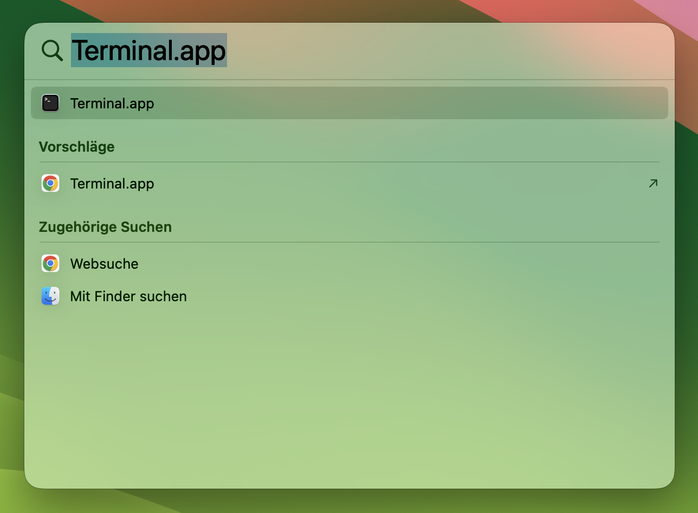
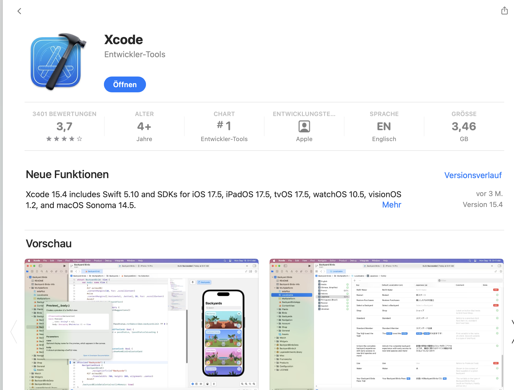
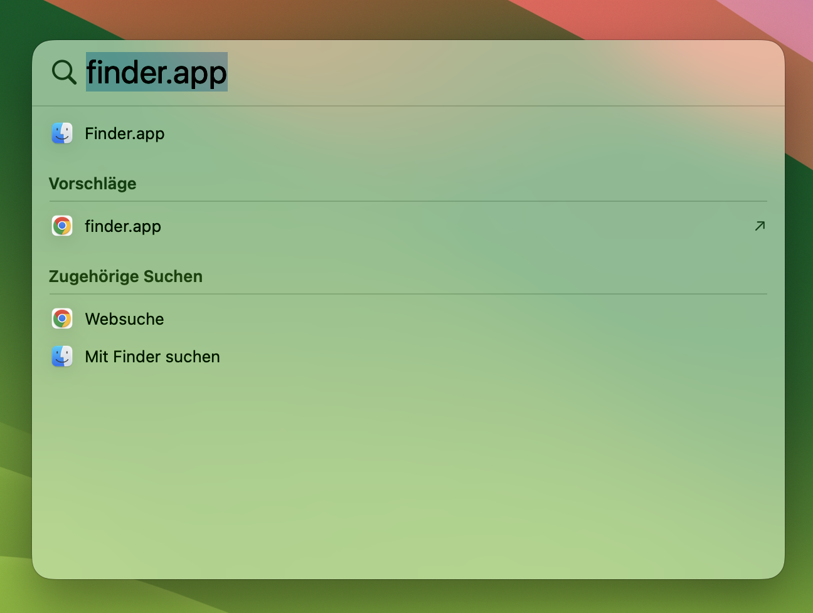
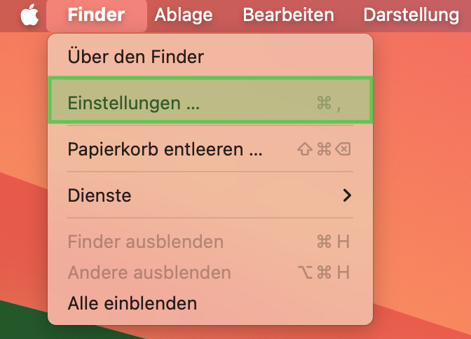
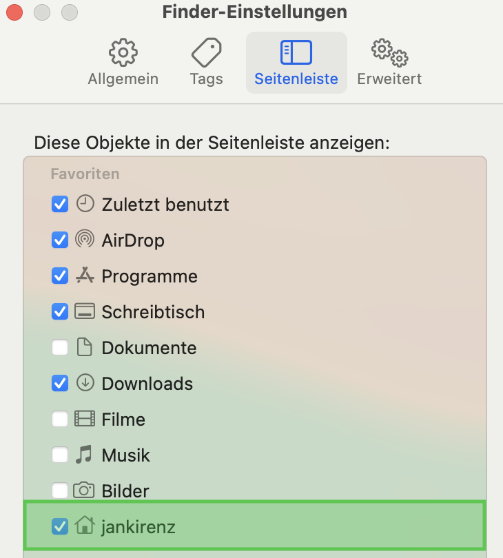
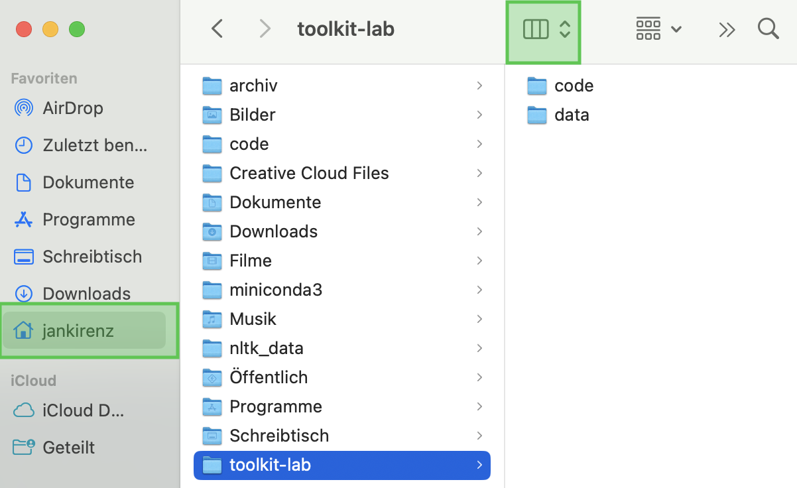

## Inhalte des Tutorials

<!-- Start of features -->
:::: {.features}

<!-- Feature one with fade-in -->
::: {.feature .fragment .fade-in}
:::{.feature-header}
Projektordner 
:::
Ordner erstellen
:::

<!-- Feature two with fade-up -->
::: {.feature .fragment .fade-up}
:::{.feature-header}
Terminal & Shell
:::
Grundlagen kennenlernen
:::


<!-- Feature two with fade-up -->
::: {.feature .fragment .fade-up}
:::{.feature-header}
Terminal-Befehle 
:::
Befehle lernen
:::

::::


## Projektordner 

::: { layout-ncol=2 layout-valign="bottom"}

{ width=45% fig-align="left"}

{ width=55% fig-align="left"}

:::


## Spotlight Suche 🔎

Spotlight-Suche mit der Tastenkombination `Command + Leertaste` öffnen.  


{width="80%" fig-align="center"}


## Terminal öffnen

Terminal.app in Spotlight Suche eingeben und Programm auswählen.

{width="30%" fig-align="center"}


## Shell-Version prüfen

Ausgabe der Shell-Ausführung:

```bash
echo $SHELL
```


. . .


::: {.callout-important appearance="simple"}

-  `/bin/bash`: Es wird bash genutzt.  
- `/bin/zsh`: Es wird bereits zsh verwendet. 

:::


- Die Folien zu "Von bash zu zsh" sind nur relevant, falls die Ausgabe `/bin/zsh` war.

# Von bash zu zsh {.custom-gradient}


## zsh prüfen

Überprüfen, ob zsh installiert ist:

```bash
zsh --version
```


::: {.callout-important appearance="simple"}

- Keine Version: zsh ist nicht installiert 
- Version angezeigt: zsh ist installiert. 

:::

## Option 1: zsh über Terminal

Apple Xcode Command Line Tools installieren:

```bash
xcode-select --install
```

- Terminal schließen


## Option 2: zsh über App-Store


XCode [über den App-Store](https://apps.apple.com/de/app/xcode/id497799835?mt=12) installieren. 


{width="50%"}


## Wechsel von bash zu zsh

Wechsel von bash zu zsh

```bash
chsh -s /bin/zsh
```

- Terminal neu starten

# Terminal-Elemente {.custom-gradient}

## Terminal-Elemente in zsh {.smaller}

{width="30%" fig-align="left"}


| Element | Inhalt | Bedeutung |
|---------|----------|-----------|
| Benutzername | `jankirenz` | Angemeldeter Benutzer |
| Hostname | `kirenziMac` | Name des Computers |
| Aktuelles Verzeichnis | `~ `| Home-Verzeichnis (/Users/jankirenz) |
| Prompt | `%`| Terminal bereit für Befehle |


# Terminal-Befehle {.custom-gradient} 

## Übersicht {.smaller}

| Befehl | Bedeutung | Beschreibung                                                            |
|------------|--------------------------|------------------------------------------|
| `pwd`     | print working directory | Zeigt den aktuellen Verzeichnispfad an           |
| `cd`     | change directory | Wechselt in ein anderes Verzeichnis                     |
| `mkdir`    | make directory | Erstellt ein neues Verzeichnis                           |
| `ls`   | list | Listet Inhalt des Verzeichnisses auf                          |


## print working directory

Mit `pwd` Pfad des aktuellen Verzeichnisses anzeigen:
    
```bash
pwd
```

## make directory toolkit-lab


Mit `mkdir` Ordner *toolkit-lab* erstellen:


```bash
mkdir toolkit-lab
```

## change directory

Mit `cd` in das Verzeichnis *toolkit-lab* wechseln:


```bash
cd toolkit-lab
```

## make directory code & data

Mit `mkdir` die Verzeichnisse *code* und *data* erstellen:


```bash
mkdir code data
```

## list

Mit `ls` die Verzeichnisse anzeigen lassen: 


```bash
ls
```

# macOS Finder {.custom-gradient}

## Finder öffnen {.smaller}

Spotlight-Suche mit der Tastenkombination `Command + Leertaste` öffnen   

Finder in Spotlight Suche eingeben und Programm auswählen.

{width=100% fig-align="center"}


## Finder Einstellungen ändern


::: { layout-ncol=2 layout-valign="bottom"}

{width=100%}

{ width=65%}

:::

## Ordner in Finder anzeigen

{ width=40%}


# Zusammenfassung 

<!-- Start of features -->
:::: {.features}

<!-- Feature one with fade-in -->
::: {.feature .fragment .fade-in}
:::{.feature-header}
Projektordner 
:::

toolkit-lab/  
    - code/  
    - data/

:::

<!-- Feature two with fade-up -->
::: {.feature .fragment .fade-up}
:::{.feature-header}
Terminal & Shell
:::

bash vs zsh
Benutzername   
Hostname   
Home-Verzeichnis  

:::


<!-- Feature two with fade-up -->
::: {.feature .fragment .fade-up}
:::{.feature-header}
Terminal-Befehle 
:::
pwd    
mkdir    
cd  
ls
:::

::::