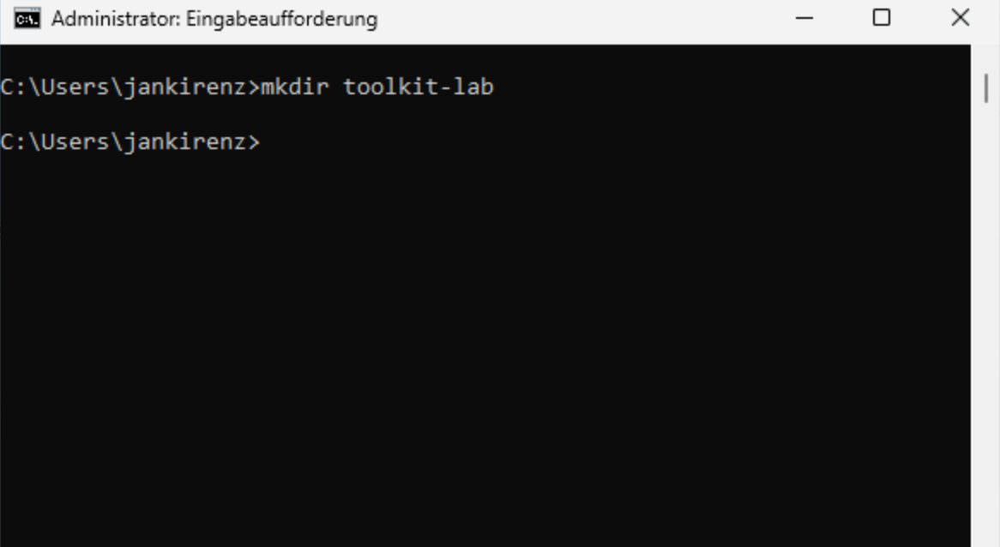
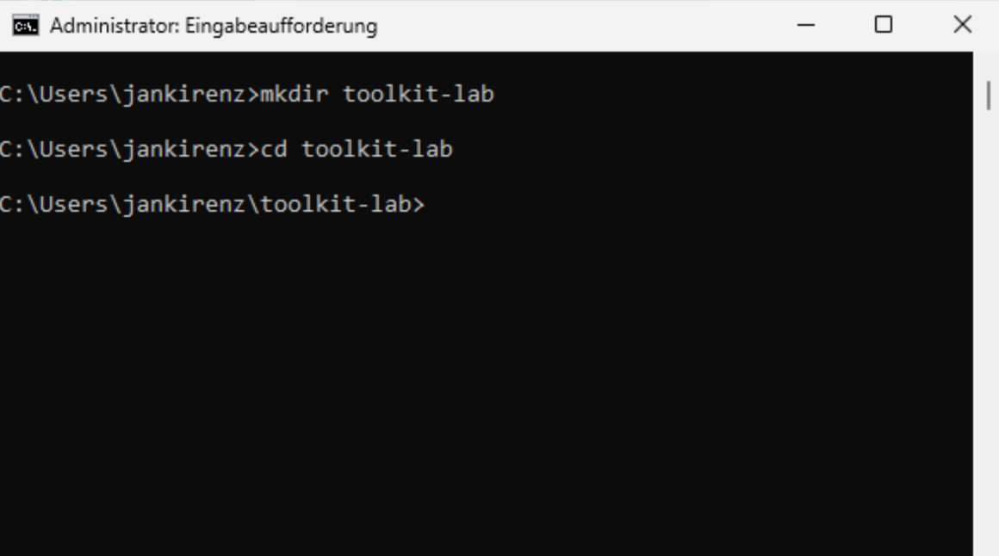
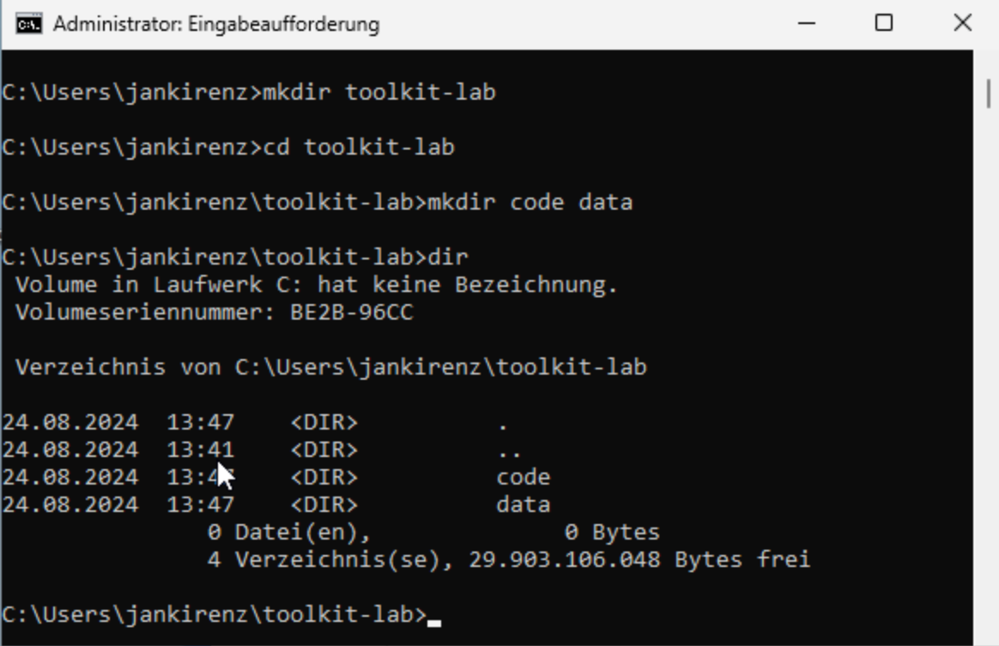

## Inhalte des Tutorials

:::: {.features}

::: {.feature .fragment .fade-in}
:::{.feature-header}
Eingabeaufforderung 🖥️
:::
Windows Command Prompt öffnen und nutzen
:::

::: {.feature .fragment .fade-up}
:::{.feature-header}
Projektordner 📁
:::
Ordnerstruktur erstellen
:::

::: {.feature .fragment .fade-up}
:::{.feature-header}
Windows Explorer 🗂️
:::
Ordner im Explorer anzeigen
:::

::::


## Projektordner 

::: { layout-ncol=2 layout-valign="bottom"}

{ width=45% fig-align="left"}

{ width=55% fig-align="left"}

:::


## Eingabeaufforderung öffnen 🖥️

1. Windows-Suchfenster öffnen
2. "Eingabeaufforderung" eingeben
3. Rechtsklick auf das Symbol
4. "Als Administrator ausführen" wählen
5. Berechtigung erteilen

{width="60%" fig-align="center"}

## Zum Benutzerverzeichnis wechseln

Mit `cd` zum Benutzerverzeichnis wechseln:

. . .

```bash
cd %userprofile%
```

- `%userprofile%`: Umgebungsvariable für den Profilordner des angemeldeten Benutzers
- Beispiel: C:\\Users\\jankirenz

## Projektordner erstellen 📁

Mit `mkdir` den Hauptordner "toolkit-lab" erstellen:

. . .

```bash
mkdir toolkit-lab
```

{width="80%" fig-align="center"}

## In den Projektordner wechseln

Mit `cd` in das Verzeichnis "toolkit-lab" navigieren:

. . .

```bash
cd toolkit-lab
```

{width="80%" fig-align="center"}

## Unterordner erstellen

Mit `mkdir` die Unterordner `code` und `data` erstellen:

. . .

```bash
mkdir code data
```

{width="80%" fig-align="center"}

## Verzeichnisinhalt anzeigen

Mit `dir` die erstellten Verzeichnisse anzeigen:

. . .

```bash
dir
```

{width="80%" fig-align="center"}

## Eingabeaufforderung schließen

Eingabeaufforderung mit `exit` schließen:

. . .

```bash
exit
```

## Windows Explorer 🗂️

Schritte zum Anzeigen der Ordner im Windows Explorer:

1. Windows-Suchfenster: "Explorer" eingeben
2. Im Explorer: "Dieser PC" auswählen
3. "Lokaler Datenträger (C:)" öffnen
4. "Users" Ordner öffnen
5. Eigenen Benutzernamen auswählen
6. "toolkit-lab" Ordner sollte sichtbar sein

## Zusammenfassung 

:::: {.features}

::: {.feature .fragment .fade-in}
:::{.feature-header}
Eingabeaufforderung 🖥️
:::
Als Administrator öffnen
cd, mkdir, dir, exit
:::

::: {.feature .fragment .fade-up}
:::{.feature-header}
Projektordner 📁
:::
toolkit-lab/
    - code/
    - data/
:::

::: {.feature .fragment .fade-up}
:::{.feature-header}
Windows Explorer 🗂️
:::
Ordnerstruktur im Explorer anzeigen
:::

::::