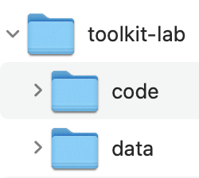
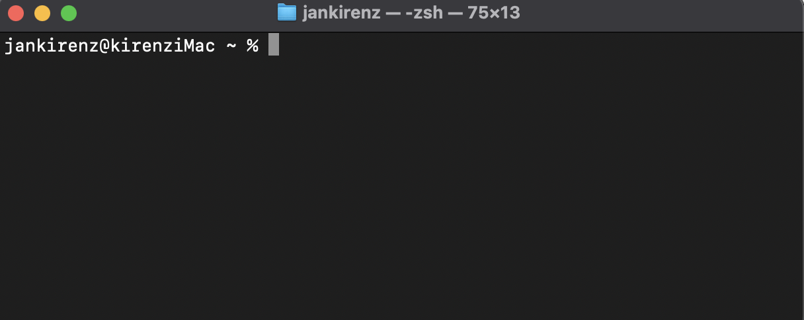

## Inhalte des Tutorials

:::: {.features}

::: {.feature .fragment .fade-in}
:::{.feature-header}
Projektstruktur 🗂️
:::
Ordnerstruktur anlegen
:::

::: {.feature .fragment .fade-up}
:::{.feature-header}
Befehlszeile 💻
:::
Grundlagen verstehen
:::

::: {.feature .fragment .fade-up}
:::{.feature-header}
Betriebssysteme 🖥️
:::
Windows vs. macOS
:::

::::

## Projektstruktur

::: {layout-ncol=2 layout-valign="bottom"}

{width=45% fig-align="left"}

{width=55% fig-align="left"}

:::

## GUI vs Befehlszeile  

- **GUI**: Grafische Benutzeroberfläche (z.B. Windows Explorer, macOS Finder)

- **Befehlszeile**: Textbasierte Interaktion mit dem Betriebssystem

. . .

::: {.callout-note appearance="minimal"}
Befehlszeile: effizientere Aufgabenausführung als eine GUI.
:::

## Bezeichnungen der Befehlszeile

- Kommandozeile
- Befehlszeilenschnittstelle
- Command Line Interface (CLI)

. . .

::: {.callout-tip appearance="minimal"}

- Windows: Eingabeaufforderung und PowerShell
- macOS: Terminal

:::

## Windows Eingabeaufforderung

 

{width=100% fig-align="left"}

## MacOS Terminal

 

{width=100% fig-align="left"}

## Shell-Konzept

- Shell: Vermittler zwischen Benutzer und Betriebssystem
- Interpretiert Eingaben und übersetzt sie in Systemanweisungen

::: {.fragment .fade-in}
Befehlszeile = "Blatt Papier" für Anweisungen
:::

::: {.fragment .fade-in}
Shell = "Übersetzer" der Anweisungen
:::

## Shells in verschiedenen Betriebssystemen

::: {.panel-tabset}

### Windows

- Standardprogramm: Eingabeaufforderung (Command Prompt)
- Standardshell: cmd.exe
- Alternative: PowerShell (leistungsfähiger)

### macOS

- Programm: Terminal
- Aktuelle Standardshell: zsh (Z Shell)
- Frühere Standardshell (vor Sept. 2019): bash (Bourne Again Shell)

:::

## Bedeutung der Befehlszeile

- Wichtige Fähigkeit in Datenanalyse und Softwareentwicklung
- Ermöglicht präzise Kontrolle über das System
- Nützlich für Automatisierungen

## Zusammenfassung

:::: {.features}

::: {.feature .fragment .fade-in}
:::{.feature-header}
Projektstruktur 🗂️
:::
toolkit-lab/
  - code/
  - data/
:::

::: {.feature .fragment .fade-up}
:::{.feature-header}
Befehlszeile & Shell 💻
:::
Textbasierte Interaktion
Effizienz & Kontrolle
:::

::: {.feature .fragment .fade-up}
:::{.feature-header}
Betriebssysteme 🖥️
:::
Windows: Eingabeaufforderung
macOS: Terminal
:::

::::

# {.n-class}

- [Thank]{.pink}
- you