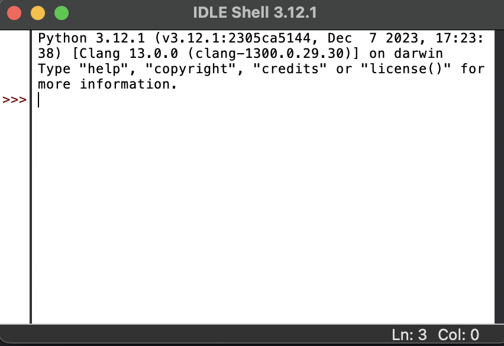
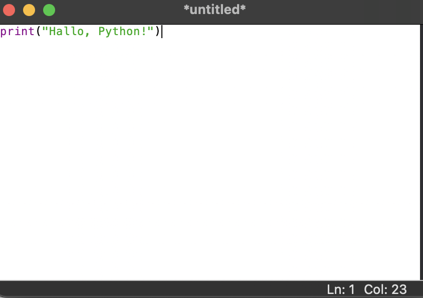
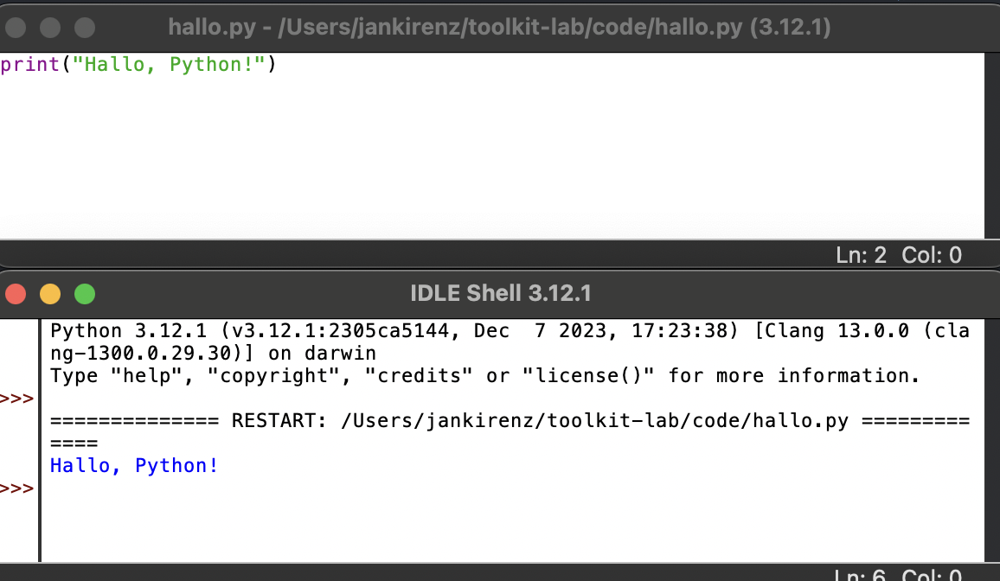

## Inhalte des Tutorials

:::: {.features}

::: {.feature .fragment .fade-up}
:::{.feature-header}
IDLE Shell
:::
Grundlagen verstehen
:::

::: {.feature .fragment .fade-up}
:::{.feature-header}
Python-Skript 
:::
Erstellen und ausführen
:::

::::


## IDLE starten

- **Windows**: Startmenü öffnen und nach "IDLE" suchen

- **Mac**: In Spotlight-Suche (Command + Leertaste) "IDLE" eingeben und auswählen

## IDLE-Shell

{width="100%" }

- Interaktive Schnittstelle zum Python-Interpreter
- Direkte Eingabe und Ausführung von Python-Code
- Beispiel: `2 + 3` eingeben und Enter drücken

## Datei öffnen

- Neue Datei öffnen: `Datei` > `Neue Datei`
- Code eingeben:

. . .

```python
print("Hallo, Python!")
```


{ width="100%" fig-align="left" }


## Python-Skript speichern

- Als `hallo.py` im `code`-Ordner speichern

. . .

:::{.callout-tip appearance="simple"}
.py-Datei: Enthält Code in der Programmiersprache Python.
:::


- Ausführen: F5 (Mac: fn + F5) oder `Ausführen` > `Modul ausführen`
## Python Skript und Ausgabe

{ width="100%" }


Ausgabe in der IDLE-Shell betrachten


## Zusammenfassung

:::: {.features}


::: {.feature .fragment .fade-up}
:::{.feature-header}
IDLE Shell
:::
Interaktiver Python-Interpreter
:::

::: {.feature .fragment .fade-up}
:::{.feature-header}
Python-Skript 
:::
.py-Datei  
Ausführung mit F5
Ausgabe in IDLE-Shell
:::


::::


